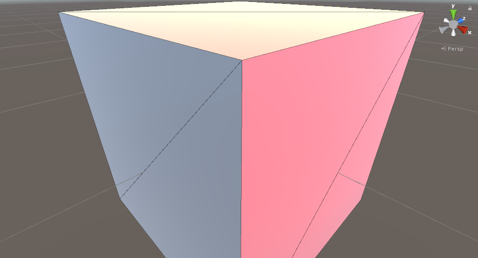
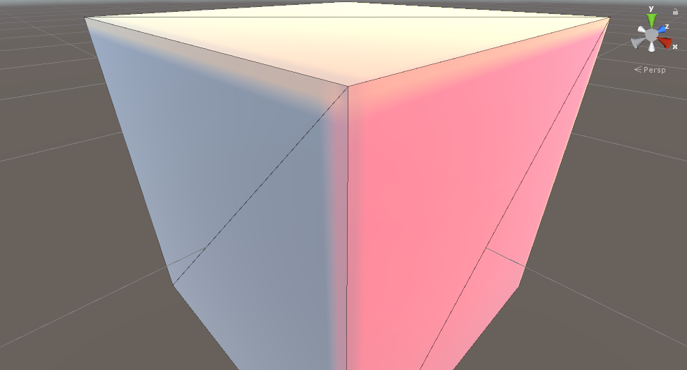

# seamoptimizer

This is Unity port of [and/seampotimizer](https://github.com/ands/seamoptimizer). The idea comes from [Lighting Technology of „The Last Of Us”](http://miciwan.com/SIGGRAPH2013/Lighting Technology of The Last Of Us.pdf).

Unity has provided [Lightmap seam stitching](https://docs.unity3d.com/Manual/Lightmapping-SeamStitching.html) for its Progressive Lightmapper. You may also check that if you need this.

**This is a part time project just for fun. No heavy use in project yet.** If you encounter any problem and is willing to provide scene example, I'll dig in when free.

# Example

Just a corner case: a cube with different lightmapped color on faces.

After optimizing seams, these connect faces get blurred.

All the functions are provided in the `SO` menu.

# Thanks

- To Andreas for his seamoptimizer. (I also like his work lightmapper a lot!)